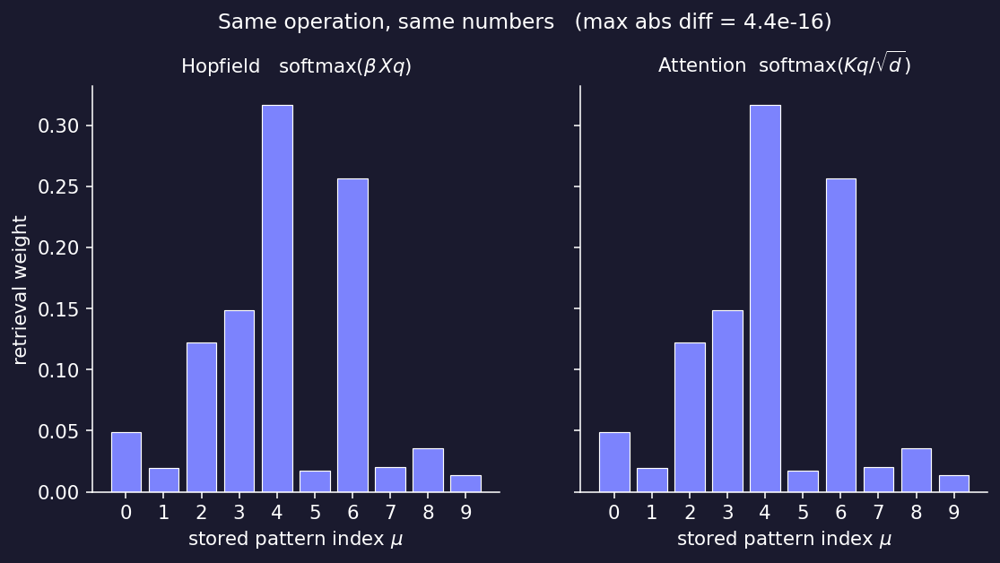

# modern-hopfield

> The modern Hopfield network and the Transformer attention mechanism are
> the same operation. This repository makes that equivalence explicit in
> ~150 lines of JAX.



The two bar charts are produced by two functions written from different
viewpoints — an associative memory and an attention layer — given
identical inputs. The maximum absolute difference is `4e-16`.

## What's implemented

- **Classical Hopfield** — `hebbian_store`, `energy`, `async_update`,
  `sync_update`. Binary `+/-1` patterns, gradient descent on the
  quadratic energy surface.
- **Modern (continuous) Hopfield** — `modern_store`, `modern_energy`,
  `modern_retrieve`. Log-sum-exp energy, softmax fixed-point iteration,
  exponential storage capacity.
- **`vmap` + `jit` batch retrieval** — `batch_retrieve`, `fast_retrieve`.
  Two lines on top of `modern_retrieve`; in the demo notebook it beats
  the Python-loop baseline by `>10000x` on CPU.
- **Attention equivalence proof** — `attention`, `verify_equivalence`.
  Asserts one step of modern Hopfield retrieval equals scaled
  dot-product attention, to floating-point precision.

## The math

Modern Hopfield update (Ramsauer et al. 2020):

$$
\mathbf{s}_{t+1} \;=\; X^{\top}\,\mathrm{softmax}\!\bigl(\beta\, X\, \mathbf{s}_{t}\bigr)
$$

Scaled dot-product attention (Vaswani et al. 2017):

$$
\mathrm{Attention}(Q, K, V) \;=\; V^{\top}\,\mathrm{softmax}\!\bigl(K Q / \sqrt{d}\bigr)
$$

These are the same expression under

$$
K \;=\; V \;=\; X,\qquad Q \;=\; \mathbf{s}_{t},\qquad \beta \;=\; 1/\sqrt{d}.
$$

A Transformer attention head reading from its context is performing one
step of modern Hopfield fixed-point iteration. The stored memories are
the keys and values. The query is the query.

## Why JAX

Three primitives carry the whole library.

**`jax.grad`** — the update rule of either Hopfield network is the
gradient of its energy. No backward-pass code required:

```python
import jax
grad_E = jax.grad(hopfield.energy, argnums=1)   # -W s
```

**`jax.vmap`** — go from single-query retrieval to batched retrieval by
specifying which axis is the batch, not by rewriting the function:

```python
batch_retrieve = jax.vmap(modern_retrieve, in_axes=(None, 0, None, None))
```

**`jax.jit`** — compile the whole thing to fused XLA kernels with one
decorator. The benchmark cell in `demo.ipynb` shows `>10000x` speedup
over the Python-loop baseline on CPU:

```python
fast_retrieve = jax.jit(batch_retrieve, static_argnums=(3,))
```

## Quick start

```bash
git clone https://github.com/<you>/modern-hopfield && cd modern-hopfield
pip install -r requirements.txt
jupyter notebook demo.ipynb
```

The notebook is self-contained: it runs the four sections above and
regenerates every figure in `figures/`.

## References

- Hopfield, J. J. (1982). *Neural networks and physical systems with
  emergent collective computational abilities.* PNAS 79(8).
- Ramsauer, H., Schäfl, B., Lehner, J., et al. (2020). *Hopfield
  Networks is All You Need.* arXiv:2008.02217.
- Millidge, B., Salvatori, T., Song, Y., Lukasiewicz, T., Bogacz, R.
  (2022). *Universal Hopfield Networks: A General Framework for
  Single-Shot Associative Memory Models.* ICML.
